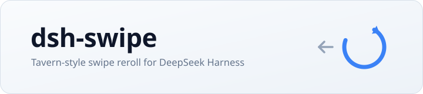

<p align="center">
  
</p>

<h1 align="center">dsh-swipe</h1>

<p align="center"><strong>版本 0.1.0</strong></p>

<p align="center">
  <em>DeepSeek Harness 的酒馆式 swipe 重roll —— 任意一条助手回复都能换一版，并在版本链上左右切换。</em>
</p>

<p align="center">
  <a href="https://github.com/CXY1523/dsh-swipe/stargazers"></a>
  <a href="https://github.com/CXY1523/dsh-swipe/blob/main/LICENSE"></a>
  <a href="https://www.deepseek.com/harness/"></a>
  <br>
  
  
  
</p>

<p align="center">
  <a href="README.md">English</a> | <a href="README.zh-CN.md">中文</a>
</p>

> 对齐 **dsh 0.1.1-rc.2**。依赖 `conversation.chat.assistant-actions` slot 与 `sessions.fork` / `session.prompt` 客户端 API；缺失这些接口的版本上插件能加载，但不会渲染按钮。

---

## 这是什么

**dsh-swipe** 是 [DeepSeek Harness](https://www.deepseek.com/harness/) 的纯客户端 Web 插件。它在每条已完成的助手回复上放一个重roll按钮，并把结果维护成一条可以来回走的版本链。

- 每条助手回复上的 `⟳` **换一版** —— 分叉会话并重新生成该轮。
- 版本回复上的 `◀ 2/3 ▶` **版本条** —— 在同一回复的各版本之间跳转。
- **链式重roll** —— 对某一版继续 `⟳`，生成 v3、v4……
- **不含宿主代码** —— 插件不碰会话日志，只调用公开的 Web 客户端 API。

DSH 的会话日志是只追加的，没有原地重写历史的接口。因此每个版本是一个真实的分叉会话，旧版本完整保留，切换版本等于切换会话。这是酒馆 swipe 在该引擎上最忠实的映射，而且多了一点酒馆没有的东西：每个版本都保留了自己完整可继续探索的分支。

---

## 功能一览

| | |
|---|---|
| 入口位置 | 消息操作条（复制与分支之间） |
| fork 锚点 | 上一个已完成轮的结束点，子会话从本轮的用户消息开始 |
| 自动重发 | 该轮的用户消息会自动重发进子会话 |
| 版本存储 | 浏览器 `localStorage`，键名 `dsh-swipe:v1` |
| 版本切换 | `sessions.open(versionSessionId)`，会话跳转，无需刷新 |
| 子会话标题 | 通过 `increaseTitle` 继承并递增（如 `标题 (2)`） |
| 图标 | 系统自带图标集（`IconRefreshOutline16`、chevron 14） |
| 多语言 | `zh` / `en`，注册在 `dsh-swipe` locale 命名空间下 |

---

## 重roll 的执行过程

```
会话 A（当前）
  …… 之前的轮次 ……
  user   U      ← 想换一版的那一轮
  assistant R   ← 在这里点 ⟳
                 │
                 ├─ 以"上一个已完成轮的结束点"fork 会话 A
                 │     子会话种子恰好停在该轮的用户消息 U
                 ├─ 子会话 B（parentSessionId = A）
                 ├─ 向 B 发送 prompt(U.content)
                 └─ 打开 B
会话 B（v2）
  …… 之前的轮次 ……
  user   U      ← 来自种子
  user   U      ← 自动重发的同一条
  assistant R'  ← 新版本，旁边显示 ◀ 2/2 ▶
```

版本链存在 `localStorage`，以根会话的锚点用户消息 seq 为键：

```jsonc
{
  "chains": {
    "session-abc…:42": { "anchorSeq": 42, "versions": ["session-abc…", "session-def…"] }
  },
  "bySession": {
    "session-abc…": { "chainId": "session-abc…:42", "index": 0 },
    "session-def…": { "chainId": "session-abc…:42", "index": 1 }
  }
}
```

版本回复按位置定位 —— 根会话取锚点之后的第一条助手消息，分叉会话取重发消息之后的第一条 —— 所以对话继续变长时版本条仍停在对的那条消息上。

清空 `localStorage["dsh-swipe:v1"]` 只会忘掉版本链，会话和消息不受影响。

---

## 与酒馆 swipe 的对照

| | 酒馆（SillyTavern） | dsh-swipe |
|---|---|---|
| 多版本存放 | 同一个 chat 里的多个候选回复 | 每个版本一个会话（fork 树） |
| 切换方式 | 原地左右 swipe | 从版本条跳转会话 |
| 重新生成上下文 | 重发提示词，旧候选被丢弃 | 从该轮用户消息处全新分叉 |
| 旧版本 | 留在 swipe 列表里 | 作为完整父会话保留 |
| 可覆盖范围 | 通常只对最后一条 | 当前窗口内任意一条助手回复 |

---

## 安装

dsh 从 **profile** 加载插件：profile 的 `package.json` 里既有插件依赖，也在 `dsh.profile.bundles` 中列出。二选一即可。

**本地目录（开发时推荐）**

```jsonc
// <profile>/package.json
{
  "dependencies": {
    "dsh-swipe": "link:C:/path/to/dsh-swipe"
  },
  "dsh": {
    "profile": {
      "bundles": [
        // …… 其他 bundle ……
        "dsh-swipe"
      ]
    }
  }
}
```

**从 git 安装**

```jsonc
"dsh-swipe": "github:CXY1523/dsh-swipe"
```

随后安装并重启 dsh：

```bash
cd <profile>
pnpm install
# 重启 dsh —— 插件的客户端 bundle 由 boot manifest 分发
```

profile 通常在 `~/.dsh/profiles/web`。重启后请硬刷新页面（`Ctrl+Shift+R`），让浏览器拿到新的 boot manifest。

**确认已加载**

```bash
curl -s http://127.0.0.1:3080/ | grep -o '"id":"dsh-swipe"[^}]*'
# {"id":"dsh-swipe","url":"/plugins/dsh-swipe/client.js?rev=…","rev":"…","inject":[…]}
```

如果这一行不存在，问题在 profile 的 `bundles` 或 `pnpm install`，不在插件代码。

---

## 使用

1. 悬停在某条助手回复上，点操作条里的 **⟳**。
2. 会话分叉、该轮用户消息被重发，新回复流式出现在新会话里。
3. 版本回复的操作条上会出现 **◀ i/n ▶**，点箭头即可在版本之间来回（切换会话，不丢任何内容）。
4. 在任意版本上继续点 **⟳** 就能把链子继续往下推。

按钮的悬停表现与系统自带操作完全一致：默认三级文字色，悬停升到二级并出现圆形背景。

---

## 目录结构

```
dsh-swipe/
├── client.js              # 插件全部逻辑：slot 入口、重roll、版本存储、界面
├── package.json           # dsh.client（platform/inject）+ dsh.bundle.patch
├── cordis.patch.yml       # 把插件插入 profile 的 layer 栈
├── lib/
│   └── index.js           # 宿主入口 —— 有意留空（纯客户端插件）
├── docs/
│   └── banner.svg
├── README.md              # English
├── README.zh-CN.md        # 中文
└── LICENSE
```

---

## 集成点

| 项 | 约定 |
|---|---|
| Slot | `conversation.chat.assistant-actions`（`kind: list`，session 作用域）—— 每条已完成消息操作行内的条目区 |
| 服务 | `ctx.slots`、`ctx.locale`、`ctx.sessions` |
| 会话 API | `sessions.fork({ sessionId, atSeq, increaseTitle })`、`sessions.open(id)`、`sessions.binding(id)?.session.prompt(content, "queue")` |
| 快照读取 | `snapshot.nodes`（已定稿消息）、`snapshot.turnEnds`（turn → `turn/end` 的 seq） |
| 图标 | `@deepseek-ai/dsh-client-ui-primitives`，已在 `dsh.client.inject` 声明 |
| 存储 | `localStorage["dsh-swipe:v1"]` |

---

## 已知限制

- **纯客户端功能。** 宿主端是空实现：没有 HTTP 路由、没有模型工具、没有提示词注入。
- **版本即会话。** 切换版本会切换会话。想同时对比两版，可以在另一个标签页打开父会话。
- **受窗口限制。** 重roll 方案基于客户端已加载的消息窗口（50 条）。滚出窗口的回复不会渲染按钮，翻回历史后才可用。
- **仅文本。** 锚点用户消息里的图片块在重发时会被丢弃；纯非文本消息无法重roll。
- **第一轮回退。** 若该轮之前没有已完成的轮，锚点退化为该轮本身，子会话会带着旧回复和其后可能存在的用户消息。
- **元数据留在本地。** 版本链存在单个浏览器里；换浏览器或清空存储只是丢掉版本条，不会影响会话本身。

---

## 开发

```bash
# 语法检查（bundle 是脚本包裹的 CJS，无需构建）
node --check client.js

# 改完后重启 dsh，并硬刷新页面
```

bundle 是原样加载的 —— `window.__ModuleLoader__.load({ id, factory })`，factory 里 `require` 平台种子（`react`）与 `dsh.client.inject` 中声明的包。没有构建步骤。

验证方式：在 profile 里启用、重启，确认某条已完成回复的操作条上出现 `⟳`。

---

## 许可

MIT
